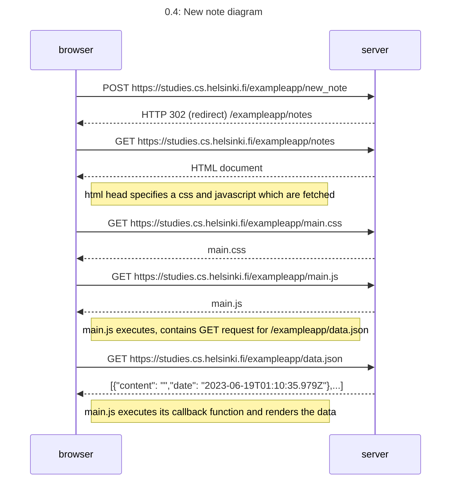
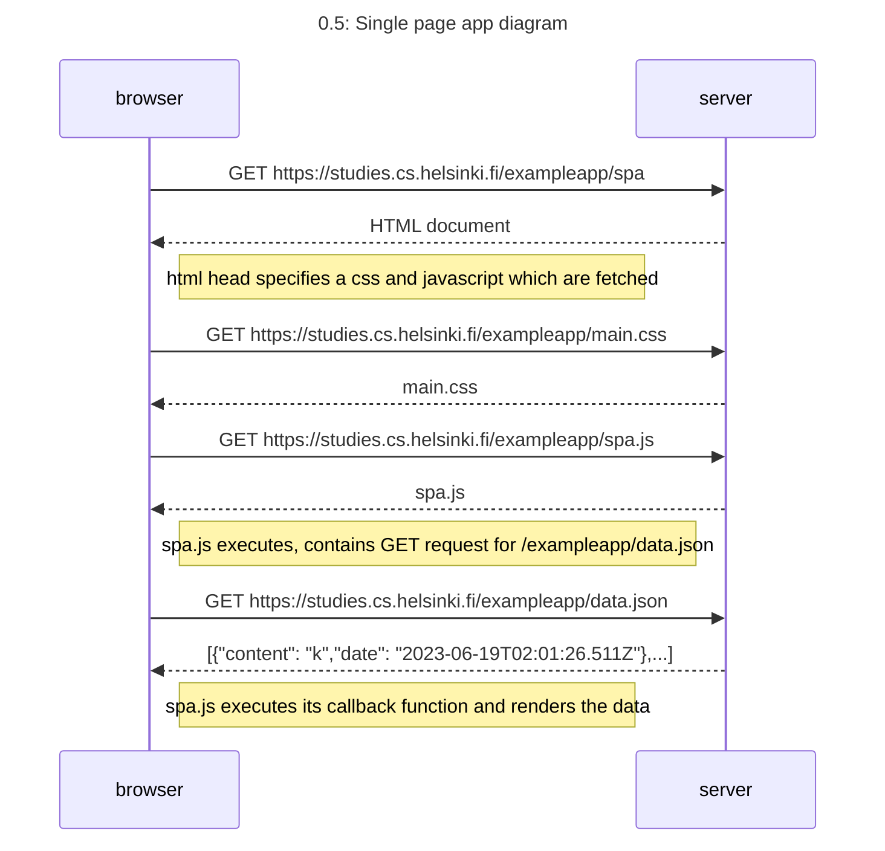
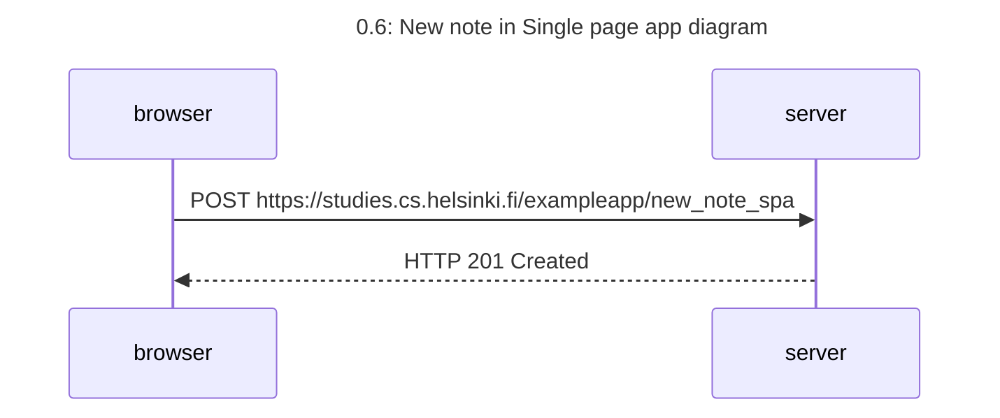

# fsopenPart0
fullstackopen part 0 Exercises 0.4-0.6

```mermaid
sequenceDiagram
title 0.4: New note diagram
browser->>server: POST https://studies.cs.helsinki.fi/exampleapp/new_note
server-->>browser: HTTP 302 (redirect) /exampleapp/notes
browser->>server: GET https://studies.cs.helsinki.fi/exampleapp/notes
server-->>browser: HTML document
note right of browser: html head specifies a css and javascript which are fetched
browser->>server: GET https://studies.cs.helsinki.fi/exampleapp/main.css
server-->>browser: main.css
browser->>server: GET https://studies.cs.helsinki.fi/exampleapp/main.js
server-->>browser: main.js
note right of browser: main.js executes, contains GET request for /exampleapp/data.json
browser->>server: GET https://studies.cs.helsinki.fi/exampleapp/data.json
server-->>browser: [{"content": "","date": "2023-06-19T01:10:35.979Z"},...]
note right of browser: main.js executes its callback function and renders the data
```

```mermaid
sequenceDiagram
title 0.5: Single page app diagram
browser->>server: GET https://studies.cs.helsinki.fi/exampleapp/spa
server-->>browser: HTML document
note right of browser: html head specifies a css and javascript which are fetched
browser->>server: GET https://studies.cs.helsinki.fi/exampleapp/main.css
server-->>browser: main.css
browser->>server: GET https://studies.cs.helsinki.fi/exampleapp/spa.js
server-->>browser: spa.js
note right of browser: spa.js executes, contains GET request for /exampleapp/data.json
browser->>server: GET https://studies.cs.helsinki.fi/exampleapp/data.json
server-->>browser: [{"content": "k","date": "2023-06-19T02:01:26.511Z"},...]
note right of browser: spa.js executes its callback function and renders the data
```

```mermaid
sequenceDiagram
title 0.6: New note in Single page app diagram
browser->>server: POST https://studies.cs.helsinki.fi/exampleapp/new_note_spa
server-->>browser: HTTP 201 Created
```
